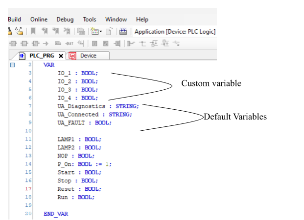
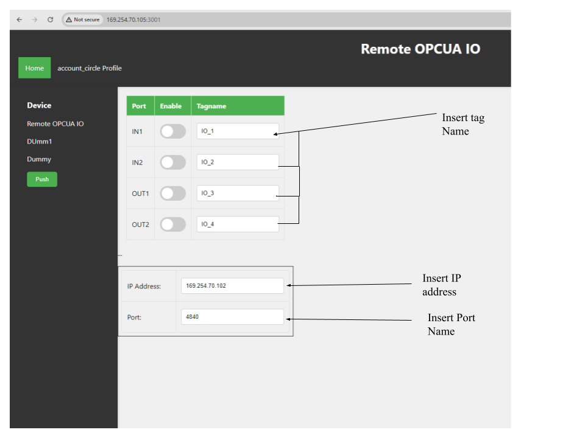
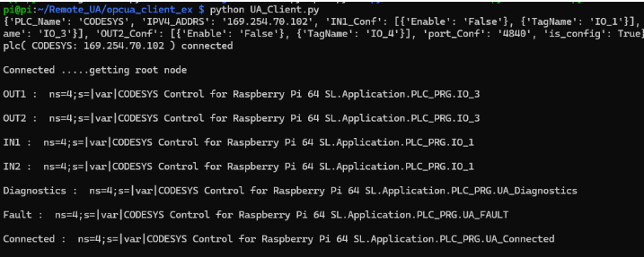

# Remote UA

# Remote I/O Project

## Overview
This project simplifies the configuration of remote I/O devices by utilizing OPC-UA as the main communication protocol. It removes the need for complex setups typically required with ETHERNET-IP, such as EDS file configuration and intricate data structure arrangements in the PLC.

## Key Features
- **Easy Configuration**: No need for complex setups or EDS files.
- **OPC-UA Protocol**: Streamlined communication without requiring extensive data structure management.
- **Plug-and-Play Interface**: Just assign matching tag names between your PLC and I/O channels and connect.

## How It Works
1. **Create Tags on the PLC**: Define tags in your PLC as you normally would.
2. **Assign Tags on the I/O Channels**: Use the web server to assign identical tag names to the respective I/O channels.
3. **Connect and Go**: The plug-and-play design allows you to connect instantly with minimal configuration.

## Benefits
- **Reduced Setup Time**: Eliminates the need for complex data structure setups and EDS file configuration.
- **Simplified Communication**: OPC-UA provides a robust, interoperable communication standard without extensive configuration.
- **User-Friendly Interface**: The intuitive web interface lets you map tags easily without additional programming.

## PLC Tags 

## Webserver overview

## Test Application configuration

## Console Output

